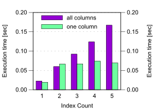

## UPDATE

`update` 语句必须重新定位已更改的索引项，以维护索引顺序。为此，数据库必须删除旧条目，并在新位置添加新条目。响应时间与各自的 `delete` 和 `insert` 语句的响应时间基本相同。

与 `insert` 和 `delete` 一样，`update` 性能也取决于表上索引的数量。唯一的区别是，`update` 语句不一定影响所有列，因为它们通常只修改少数选定的列。因此，`update` 语句并不一定会影响表上的所有索引，而只会影响包含更新列的索引

[图 8.3](#图8.3 Update 性能和索引数量关系) 显示了两个更新语句的响应时间：一个设置所有列并影响所有索引，然后第二个更新单个列，因此它只影响一个索引。

#### 图8.3 Update 性能和索引数量关系

对所有列的更新显示了我们在[前面小节](./8-1-insert.md)中已经观察到的相同模式：响应时间随着索引数量的增加而增加。只影响一个索引的更新语句的响应时间不会增加太多，因为它保持大多数索引不变。

要优化更新性能，必须注意只更新那些被改动的列。如果手动编写更新语句，这一点是显而易见的。然而，ORM工具可能会每次都生成设置所有列都更新的 `update` 语句。例如，Hibernate 在禁用动态更新模式时就会这样做。从4.0版本开始，该模式默认启用。

在使用ORM工具时，最好偶尔在开发环境中启用查询日志，以验证生成的SQL语句。在标题为"[Enabling SQL Logging](https://use-the-index-luke.com/sql/join/nested-loops-join-n1-problem#tip-orm-log-sql)"的小提示中简要概述了如何在一些广泛使用的ORM工具中启用SQL日志。

> 💡THINK
>
> 你能想到 `insert` 或 `delete` 语句不影响表的所有索引的情况吗？

