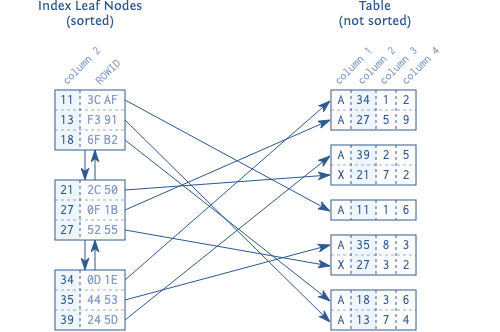

# 索引的叶子节点

索引的主要目的是提供有序的索引数据。但是由于插入语句需要挪动大量的数据以便腾出空间来插入新的数据，而移动大量数据非常耗时，
因此插入语句会变得非常缓慢，所以基于物理顺序存储是不可能的。解决这个问题的方案是建立独立于内存中物理顺序的逻辑顺序。

逻辑顺序是通过双向链表建立的。每个节点都可以链接到相邻的两个节点，就像链条一样。当插入新的节点时，可以通过更改相邻两个节点
的引用将新节点加入进来。新节点的物理位置并不重要，因为双向链表维护了逻辑顺序。

这样的数据结构我们称之为双向链表，因为每个节点都能指向前后两个节点。它能使数据库根据需求来向前或者向后读取索引。
因此可以实现在不移动大量的数据的情况下插入新数据，只需要更改一些指针。

数据库使用双向链表来链接索引的叶子节点。每个叶子节点都是存储在数据库的块（block）或者页（page）里（即数据库最小的存储单元）。
所有的索引块大小都是基本相同的，通常是几 KB。数据库会尽可能地使用块中的空间，存储尽可能多的索引项。这意味着索引的顺序被维护在
两个不同的级别：每个叶子节点内的索引条目，以及使用双向链表相互连接的叶子节点。

### 图 1.1 索引叶子节点及对应的表数据

图 1.1 展示了索引的叶子节点和它们是如何与表数据进行连接的。每个索引项都由索引列（key，column 2）组成，并引用到表的相应行（通过 ROWID）。
与索引不同，表中的数据存储在堆结构中，且是无序的。存储在同一个数据块中的行之间既没有联系，且块之间也没有任何连接。
