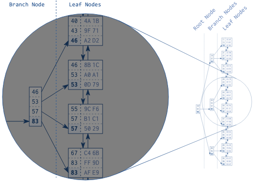

# 搜索树（B-Tree）使索引更快

索引的叶子节点是以任意顺序存储的，且索引的逻辑顺序并不与磁盘的存储顺序一一对应。它就像一个页码杂乱的电话簿。
如果你要搜索电话簿中的史密斯，但是你先在电话簿目录中翻到了鲁滨逊，那么史密斯是大不可能在鲁滨逊后面的。
数据库需要第二种结构，以便快速查找随机页面中的条目，这个结构就是平衡搜索树，即 B-Tree。

### 图 1.2 B-Tree 结构

图 1.2 展示了一个包含 30 个条目的示例索引。双向链表在叶子节点之间建立了逻辑顺序。根和分支节点支持叶子节点之间的快速搜索。

该图突出展示了一个分支节点及其对应的叶子节点。每个分支节点的键对应于它所对应的叶子节点中的最大值。
以第一个叶子节点为例：该叶子节点的最大值是 46，因此该值存储于对应分支节点的条目中。对于其他的叶子节点也是如此，
因此最后分支节点的值为 46，53，57 和 83。根据这种模式，我们可以使用分支节点建立分支层，并能覆盖全部叶子节点。

除了最高层的节点，往后的层都能重复上面说的过程，直到所有的键都能匹配到最后一个节点，即根节点。这个结构之所以称之为平衡搜索树，
是因为树的深度到每一个位置都是相同的，且根节点和叶子节点之间的距离处处相同。

创建完索引后，数据库会自动维护索引。他会处理每一个插入，删除和更新操作，以保持树的平衡，从而导致写操作的性能损耗。
在[第八章：修改数据](./dml.md) 里会更加详细地介绍这一点。

### 图 1.3 B-Tree 遍历

图 1.3 展示了一个索引片段，演示了对键：57 的搜索。树的遍历从左侧的根节点开始。每次遍历都按照节点升序的顺序，
找到一个大于或等于搜索项（57）的节点。在图中，第一个找到的条目是 83。数据库遵循分支节点的引用，不断重复上述过程，
直到树遍历到达一个叶子节点。

树遍历时一个非常高效的操作，高效到我愿称之为索引的第一动力。即使是在一个巨大的数据集上，它也能马上处理。
这主要原因是树的平衡，这样可以允许以相同的步骤数访问所有的元素，其次是因为树的深度呈对数增长。这意味与叶子节点数量相比，
树的深度增长地非常缓慢。拥有数百万条记录的真实索引的树的深度为 4 或 5。几乎看不到深度为 6 的树。

> 链接
> [B-Tree 模拟器](https://www.cs.usfca.edu/~galles/visualization/BPlusTree.html)
